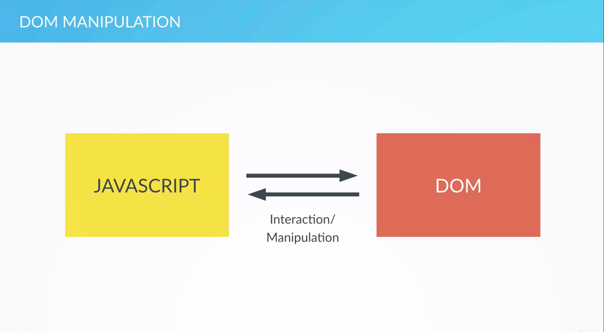

# DOM Manipulation and Events

## The DOM and DOM Manipulation

 The HTML webpage content is stored in the DOM, which can then be accessed and manipulated by a JavaScript.

* DOM: Document Object Model
* Structured representation of an HTML document
* The DOM is used to connect webpages to scripts or programming languages such as JS
* For each of these boxes, there is an object in the DOM that we can access and interact with

  it from our JavaScript code.

