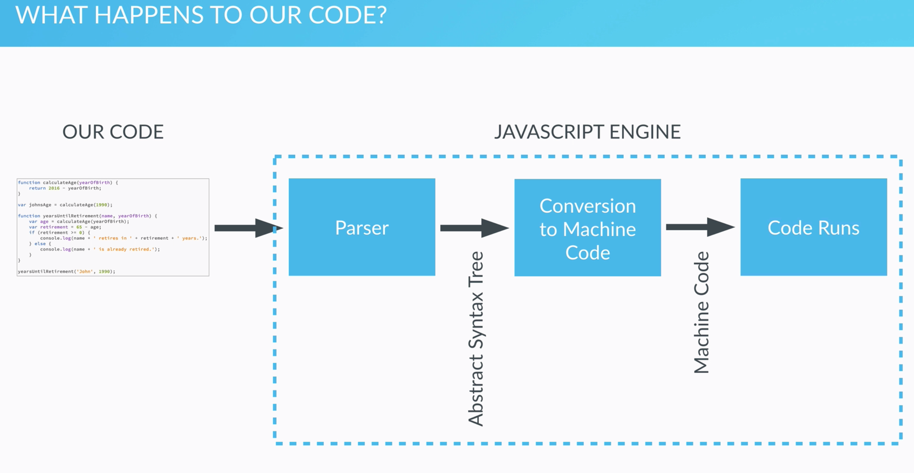
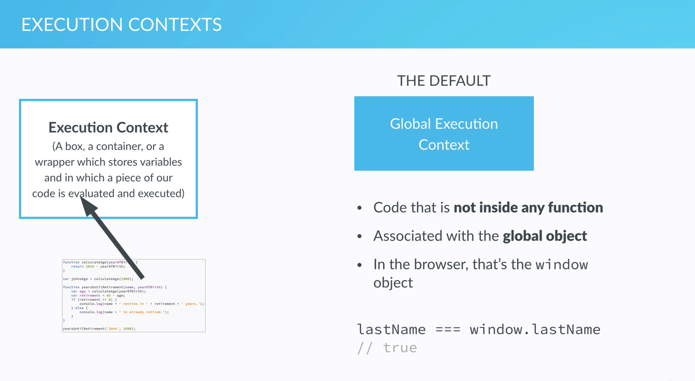
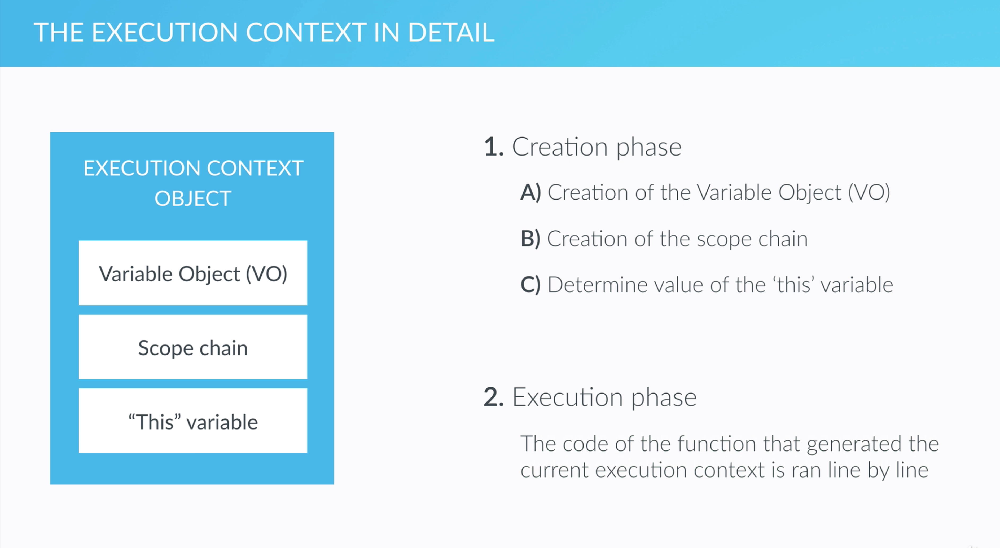

# How js code works behind the Scenes

## Javascript Parsers and Engines

* Our code is parsed by a parser,  which basically reads our code line by line, and checks if the syntax of the code that we gave it, is correct. So this means that the parser knows the JavaScript rules
* If the code is incorrect, parser will throws an error and stops the execution.
* If everything is correct though, then the parser produces a data structure known as the Abstract Syntax Tree, which is then translated into machine code.

## Execution contexts and the Execution Stack

All JavaScript code needs to run in an environment, and these environments are called execution contexts -- a box, a container, or a wrapper which stores varibales and in which piece of our code is evaluated and executed.

* The global execution context is for variables and functions that are not inside of any function. Now, you can also think of an execution context as an object. So the global execution context is associated with the global object, which in case of the browser is the window object.
* For the code in a function, each time we call a func, it gets its own brand-new execution context and put into \`execution context\`.

## Execution context in Detail: creation and execution phases and hoisting

We have three properties in execution context object

* Variable Object\(VO\) which will contain function arguments in a variable declaration as well as function declarations;
* Scope Chain, which contains the current variable objects as well as the variable objects of all its parents;
* This

When a new execution context is put on top of the execution stack, it happens in two phase

* Creation Phases
  * creation of the variable object
  * creation of the scope chain
  * determine the value of the `this` variable
* Execution phase
  * The code and the function that generated the current execution context is run line by line, and all the variables are defined.

* VO
  * The argument object is created, which contains all the arguments that were passed into the function.
  * The code is scanned for function declarations, and for each function a property is created in a variable object pointing to that function. This means that all the functions will be stored inside the variable object even before the code starts executing.
  * The code is scanned for variable declarations, and for each variable a property is created in a variable object and set to "undefined", and these last two points is what we commonly call "hoisting".
    * Functions and variables are hoisted in JavaScript, which means that they are available before the execution phase actually starts.
    * The difference between functions and variables hoisted is that functions are already defined

      before the execution phase starts, while variables are set up to "undefined", and will only be defined in the execution phase.
* Scope & Scope Chain
  * Each new function creates a scope: the space/env, in which the variables it defines are accessible.
  * Also, in Javascript we have lexical scoping, and lexical just means where something is written in the code.  Lexical scoping means that a function that is lexically within and out of function, which means that it's written inside of another function and gets access to a scope of the outer function, also called the parent function, and with that it also gets access to the variables and functions that the parent function defines.
* This
  * `this` variable is a variable that each and every execution context gets, it is stored in the execution context object.
  * In a regular function call, the this keyword simply points at the global object, which , in case of the browser, is the window object.
  * In a method call, which, it is a function that is attached to an object, the `this` variable points to the object that is calling the method.
  * `this` keyword is not assigned a value until the function where it is defined is actually called. 

